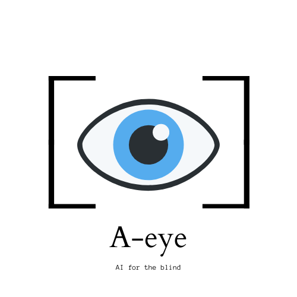

.. Aeye documentation master file, created by
   sphinx-quickstart on Thu May 21 20:39:14 2020.
   You can adapt this file completely to your liking, but it should at least
   contain the root `toctree` directive.

Aeye
================================

Aeye aspires to be an open-source AI-as-a-Service platform for hobbyists and
tinkerers to develops apps and services for the visually challenged. We want to
provide the best tools and services for you to go out there and build cool stuff
for our less privileged brothers and sisters, to empower them to prevail over
their shortcomings so that they too can come forth and contribute and fully be a
part of our society. 

The latest advancements in Computer vision thanks to technologies like Deep
Learning we are now able to augment human vision with computer vision models
that help detect the objects around us, detect faces and identify who they are,
describe the environment you are in and much more. This can be of great use to
visually challenged people, to help them perform their day to day tasks more
efficiently. 

The service offers simple to use API end points that help deliver basic deep
learning modules like Object Detection and Image Captioning.

To get started with the service get over to getting started page.

If your interested to contribute to the project happily head over to the
Contributing page to know more.

.. toctree::
   :maxdepth: 2
   
   getting-started
   imagecaptioning
   objectdetection
   facialrecognition
   endpoints
   contributing

